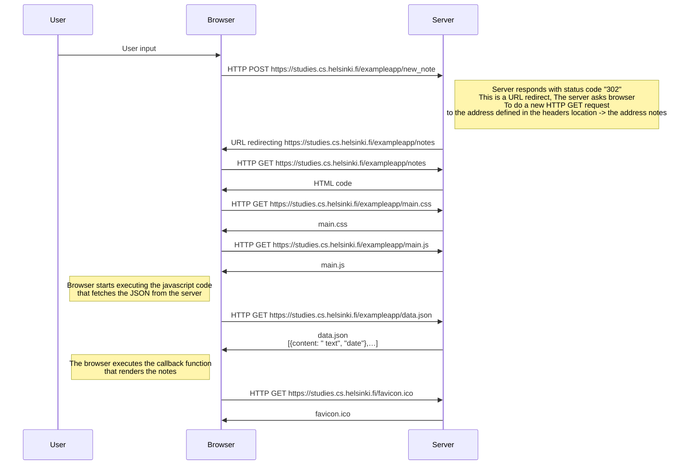

```mermaid
sequenceDiagram
    participant User
    participant Browser
    participant Server
    User->>Browser: User input
    Browser->>Server: HTTP POST https://studies.cs.helsinki.fi/exampleapp/new_note
    Note right of Server: Server responds with status code "302" <br/> This is a URL redirect, The server asks browser <br/> To do a new HTTP GET request <br/>  to the address defined in the headers location -> the address notes <br/>  
    
    Server->>Browser: URL redirecting https://studies.cs.helsinki.fi/exampleapp/notes
    Browser->>Server: HTTP GET  https://studies.cs.helsinki.fi/exampleapp/notes
    Server->>Browser: HTML code
    Browser->>Server: HTTP GET  https://studies.cs.helsinki.fi/exampleapp/main.css
    Server->>Browser: main.css
    Browser->>Server: HTTP GET  https://studies.cs.helsinki.fi/exampleapp/main.js
    Server->>Browser: main.js
    
    Note left of Browser: Browser starts executing the javascript code <br/> that fetches the JSON from the server
    
    Browser->>Server: HTTP GET https://studies.cs.helsinki.fi/exampleapp/data.json
    Server->>Browser: data.json <br/> [{content: " text", "date"},…]

    
    Note left of Browser: The browser executes the callback function <br/> that renders the notes
    
    
    Browser->>Server: HTTP GET  https://studies.cs.helsinki.fi/favicon.ico
    Server->>Browser: favicon.ico
    
    
    
    
```
