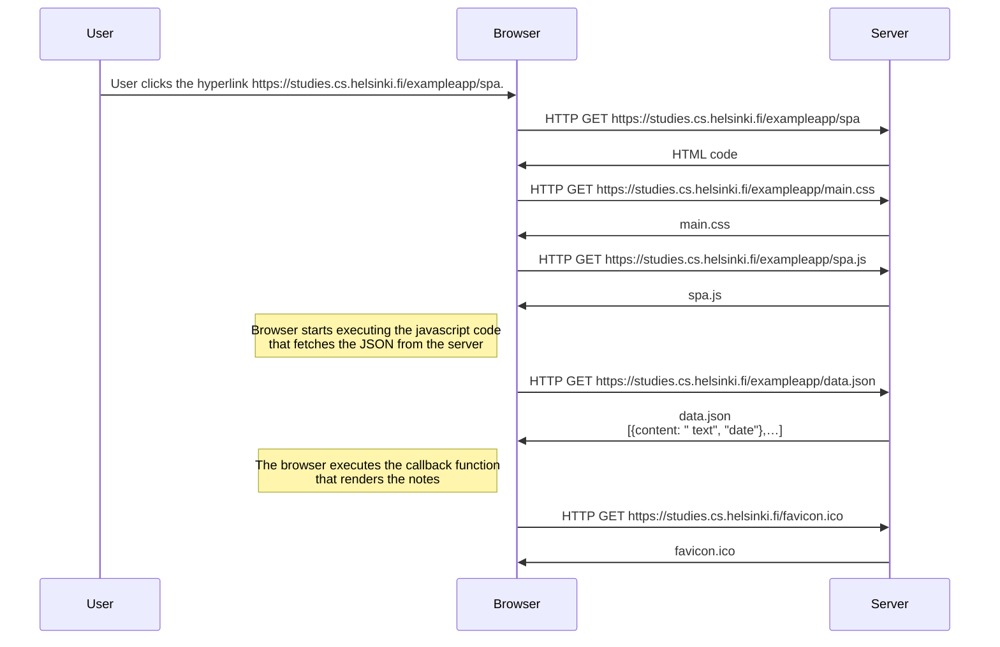

```mermaid
sequenceDiagram
    participant User
    participant Browser
    participant Server
    User->>Browser: User clicks the hyperlink https://studies.cs.helsinki.fi/exampleapp/spa.
    Browser->>Server: HTTP GET https://studies.cs.helsinki.fi/exampleapp/spa
    Server->>Browser: HTML code
    Browser->>Server: HTTP GET https://studies.cs.helsinki.fi/exampleapp/main.css
    Server->>Browser: main.css
    Browser->>Server: HTTP GET https://studies.cs.helsinki.fi/exampleapp/spa.js
    Server->>Browser: spa.js 
    
    Note left of Browser: Browser starts executing the javascript code <br/> that fetches the JSON from the server
    
    Browser->>Server: HTTP GET https://studies.cs.helsinki.fi/exampleapp/data.json
    Server->>Browser: data.json <br/> [{content: " text", "date"},…]
    
    Note left of Browser: The browser executes the callback function <br/> that renders the notes
    
    
    Browser->>Server: HTTP GET https://studies.cs.helsinki.fi/favicon.ico
    Server->>Browser: favicon.ico
    
    
    
```
