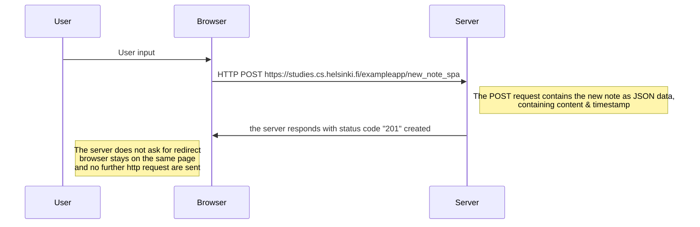

```mermaid
sequenceDiagram
    participant User
    participant Browser
    participant Server
    User->>Browser: User input
    Browser->>Server: HTTP POST https://studies.cs.helsinki.fi/exampleapp/new_note_spa
    Note right of Server: The POST request contains the new note as JSON data, <br/> containing content & timestamp

    Server->>Browser: the server responds with status code "201" created
    
    Note left of Browser: The server does not ask for redirect <br/>  browser stays on the same page <br/> and no further http request are sent
    
    
```
